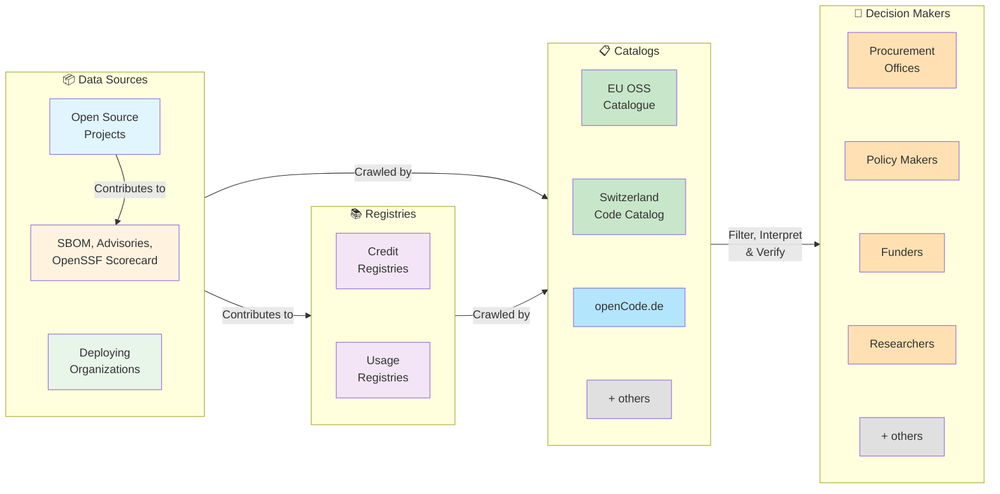

# Ecosystem Architecture: Data Flow

This diagram illustrates how the decentralized ecosystem works: how open source projects, registries, and data sources connect to feed procurement offices, researchers, and other stakeholders with comprehensive information about software quality, vendor expertise, and adoption.

## Color Coding

The diagram uses color to distinguish functional roles:

- **Light Blue** (`#e1f5ff`): Open Source Projects — the primary data source
- **Orange** (`#fff3e0`): External Security Data — SBOM, OpenSSF Scorecard, security advisories
- **Light Green** (`#e8f5e9`): Deploying Organizations — organizations declaring their own usage
- **Purple** (`#f3e5f5`): Registries — independent credit and usage registries, not owned by project hosts
- **Green** (`#c8e6c9`): Catalogs — simple catalog implementations (direct crawling of publiccode.yml)
- **Light Blue** (`#b3e5fc`): Aggregator Catalogs — sophisticated catalogs that combine multiple data sources
- **Orange** (`#ffe0b2`): Decision Makers — procurement offices, policy makers, researchers, and funders
- **Gray** (`#e0e0e0`): Placeholder boxes ("+ others") — indicating that other implementations may exist

## Architecture Principles

### The Core Innovation: Complete Independence

**Content producers publish once.** Projects, credit registries, usage registries, and organizations publish their data in standardized formats (`publiccode.yml`, registry endpoints, `/.well-known/` declarations). They do _not_ know which catalogs exist or what they do. They have no central registration requirement.

**Catalogs discover independently.** Each catalog (EU OSS Catalogue, Switzerland, openCode.de, or hypothetical future catalogs) independently decides:

- Which data sources to include (GitHub, GitLab, Gitea, custom hosting)
- How to discover registries (Registry Discovery Standard, hardcoded lists, community crowdsourcing, API partnerships)
- How to interpret and rank data (what factors matter? how to weight vendor experience vs adoption vs security scores?)
- What to display, filter, sort, and highlight for users

**No catalog controls another.** Each is free to:

- Build on different tech stacks
- Target different user needs (some might emphasize security-critical software, others language-specific, others embedded systems)
- Apply different procurement policies (PMPC, digital sovereignty, specific RFP requirements)
- Experiment with ranking algorithms and UI patterns

### Content Producers

**Open Source Projects** publish a single `publiccode.yml` file containing:

- **Metadata & Classification**: Name, description, domain, role, function, layer, audience, technology
- **Supply Chain References** (via `supplyChain` section):
  - OpenSSF Scorecard URLs for security assessments
  - SBOM (Software Bill of Materials) locations in CycloneDX or SPDX format
  - REUSE compliance status (FSFE license compliance)
  - Security policy / vulnerability disclosure URLs
- **Credit Registry Endorsements** (via `creditRegistries` field):
  - Links to external registries where vendor contributions are tracked
  - Examples: Drupal.org credit system, ecosyste.ms, custom systems
  - Allows projects to point to authoritative sources of contribution data

**Credit Registries** (Independent Infrastructure):

- Operate as independent platforms (Drupal.org credit system, ecosyste.ms, or custom systems)
- No central approval or registration required to operate a registry
- **Content is maintained by projects**: Each open source project maintains its own credit records within registries (e.g., Drupal maintainers sign off on contributor records in Drupal.org)
- Projects can endorse multiple registries via `creditRegistries` field in publiccode.yml
- Catalogs discover them via Registry Discovery Standard or direct partnerships
- Registry infrastructure is decentralized, but content attribution stays under project control

**Usage Registries** (Independent):

- Track which organizations deploy which software
- Operate independently — publish via their own APIs or websites
- No central approval or registration
- Catalogs discover them via Registry Discovery Standard or direct partnerships
- Can be crawled to find adopter declarations

**Deploying Organizations**:

- Publish `/.well-known/publiccode-usage.json` on their own domains
- Declare which software they deploy
- Discoverable by any usage registry without central coordination
- Data remains under organizational control

### External Security Data

- OpenSSF Scorecard, SBOM repositories, security advisories (GitHub/GitLab, CVE databases, EU's Global CVE Allocation System), REUSE.software
- **Referenced, not hosted**: `publiccode.yml` points to them via `supplyChain` section, doesn't duplicate them
- Keeps data authoritative and current
- Catalogs independently choose whether to follow these references

### Catalog Discovery Mechanisms

- **Registry Discovery Standard** (`/.well-known/publiccode-registry.json`): Registries advertise themselves; catalogs can crawl autonomously
- **Custom integrations**: Catalogs can also crawl GitHub search, use paid APIs, partner directly with registries
- **Human curation**: Some catalogs might include registries via community contribution
- **No gatekeeping**: Any registry can self-publish; any catalog can choose to discover

_Catalogs are not required to use Registry Discovery — they can build whatever discovery mechanism they prefer._

### Catalog Independence

Each catalog independently:

- **Discovers** providers (via publiccode.yml, GitHub search, APIs, Registry Discovery Standard, partnerships)
- **Filters** data (only include mature projects? specific domains? GPLv3+? Active in last 6 months?)
- **Interprets** data (how to rank credit vs adoption vs security score?)
- **Presents** data (faceted search? simple list? interactive recommendations?)
- **Applies policy** (digital sovereignty requirements, procurement rules, legislative mandates)

**Examples of differentiation:**

- EU OSS Catalogue might do simple indexing: "Does it run in Europe? Is it compliant with PMPC?"
- Switzerland might highlight adoption within the Swiss government
- openCode.de might rank by vendor ecosystem activity (credits + issue responses)
- A hypothetical "Healthcare OSS Catalog" might filter for 21 CFR Part 11, SOC 2, HIPAA resources

### End Users

**Procurement offices, policy makers, and researchers** access _one or more_ catalogs depending on their needs:

- A Swiss health ministry might primarily use the Switzerland Code Catalog
- An EU agency might use EU OSS Catalogue + openCode.de for comparison
- A university might use multiple to find bleeding-edge tools + well-vetted systems
- A CTO evaluating vendor partnerships might use ecosyste.ms directly instead of a catalog

Users are not locked into a single data source.

## Key Design Decisions

1. **Publish-once, discover-many**: Content producers publish standardized data once. Any number of independent catalogs can discover and use it without central coordination or registration.

2. **Catalogs are not gatekeepers**: No approval process, no single authority that decides which registries "count." Any registry can publish; any catalog can choose to include or ignore it.

3. **Catalogs compete on capability, not data access**: All catalogs have access to the same source data (publiccode.yml, registries, security data). Differentiation comes from interpretation, UI, policy application, and algorithmic ranking — not from exclusive licensing or privileged data.

4. **publiccode.yml as the anchor, not the database**: It contains metadata and _pointers_ to external data, not endpoints or ratings themselves. This keeps projects simple while enabling rich aggregation.

5. **Optional self-declaration**: Projects don't have to declare everything. Credit registries are optional (projects can skip them). Classification dimensions are optional (declare only what applies).

6. **External security data stays external**: OpenSSF Scorecard, SBOMs, and security advisories change frequently — they should stay in their authoritative sources and be referenced (not duplicated).

7. **Decentralized registries**: Credit and usage registries operate independently. No single point of control or failure. No central database of "who uses what."

8. **Catalog-specific policy**: Each catalog applies policies relevant to its stakeholders:
   - EU OSS Catalogue emphasizes EU jurisdiction and PMPC compliance
   - Switzerland emphasizes data sovereignty and Swiss security standards
   - Governments can run their own catalogs for internal procurement policies
   - No contradiction — same source data, different policy lenses

9. **Users access multiple catalogs**: Not locked into one source of truth. Can compare perspectives, validate information across sources, combine data for decision-making.

10. **No technical centralization**: Any number of implementations can coexist (GitHub sync, custom crawlers, Registry Discovery Standard clients, proprietary integrations). This supports ecosystem resilience.

---

See [PROPOSAL.md](PROPOSAL.md) for technical specifications of the extensions, APIs, and standards.
See [ROADMAP.md](ROADMAP.md) for implementation phases.
