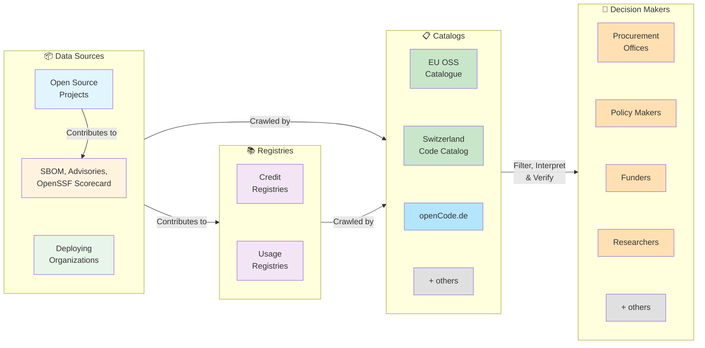

# Ecosystem Architecture: Data Flow

This diagram illustrates how the decentralized ecosystem works: how open source projects, registries, and data sources connect to feed procurement offices, researchers, and other stakeholders with comprehensive information about software quality, vendor expertise, and adoption.

_Color coding: blue = open source projects; orange = external security data; green = deploying organizations; purple = registries; darker green / light blue = catalogs; orange = decision makers; gray = "others" placeholders._

## Architecture Overview

The core design is **publish-once, discover-many**: content producers (projects, registries, deploying organizations) publish standardized data in `publiccode.yml`, registry endpoints, and `/.well-known/` declarations without knowing which catalogs exist. Each catalog independently discovers, filters, interprets, and presents data according to its own stakeholders and policies — no catalog controls another, no central authority decides which registries count. All catalogs access the same source data; differentiation comes from interpretation, ranking, and policy application, not privileged data access.

For a full description of each actor's role and the design principles behind the architecture, see [PROPOSAL.md](PROPOSAL.md).

---

See [PROPOSAL.md](PROPOSAL.md) for technical specifications of the extensions, APIs, and standards.
See [ROADMAP.md](ROADMAP.md) for implementation phases.
